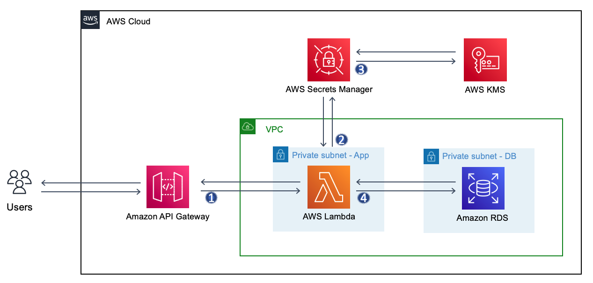
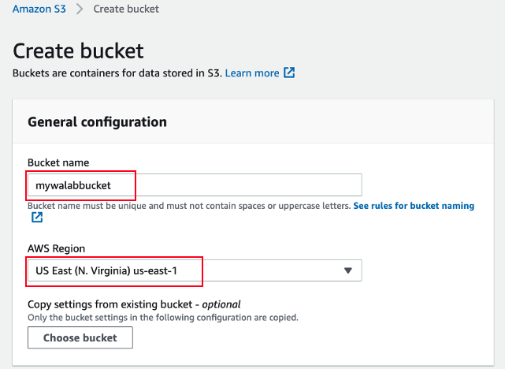
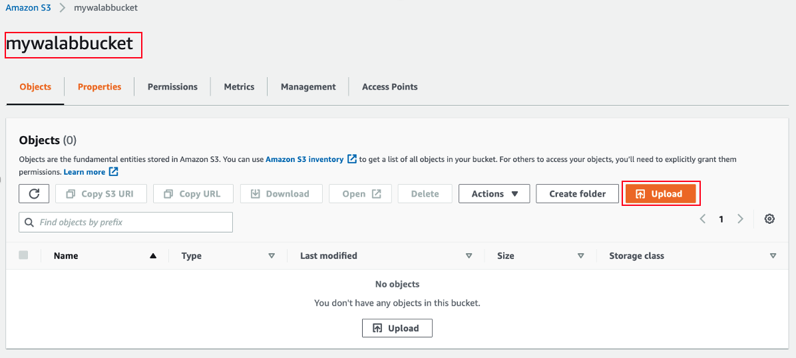
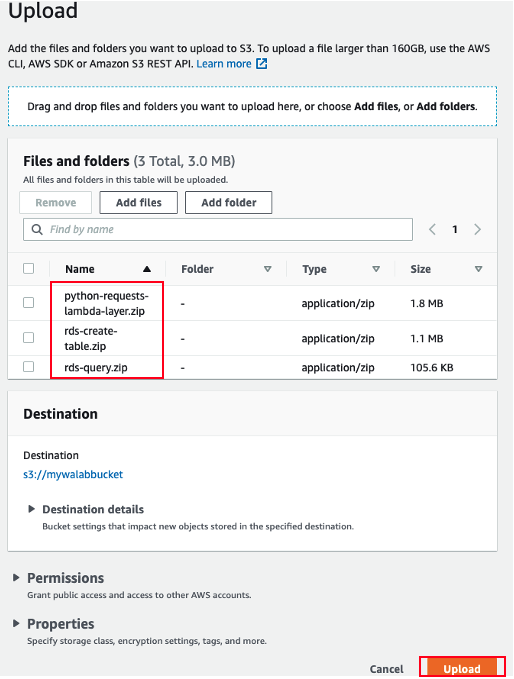
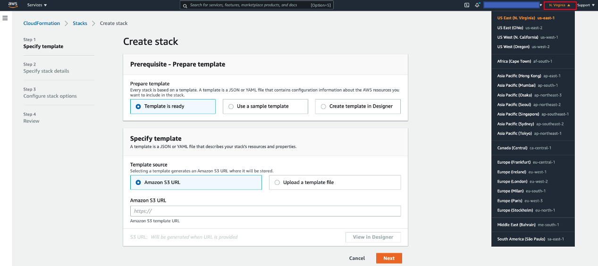
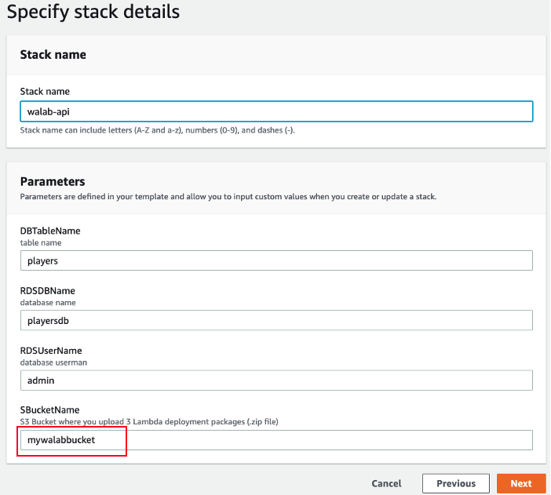
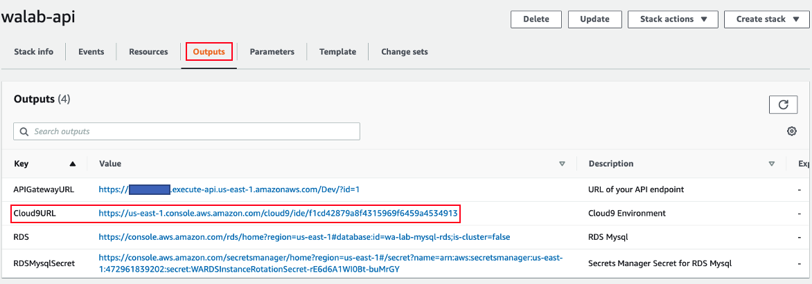
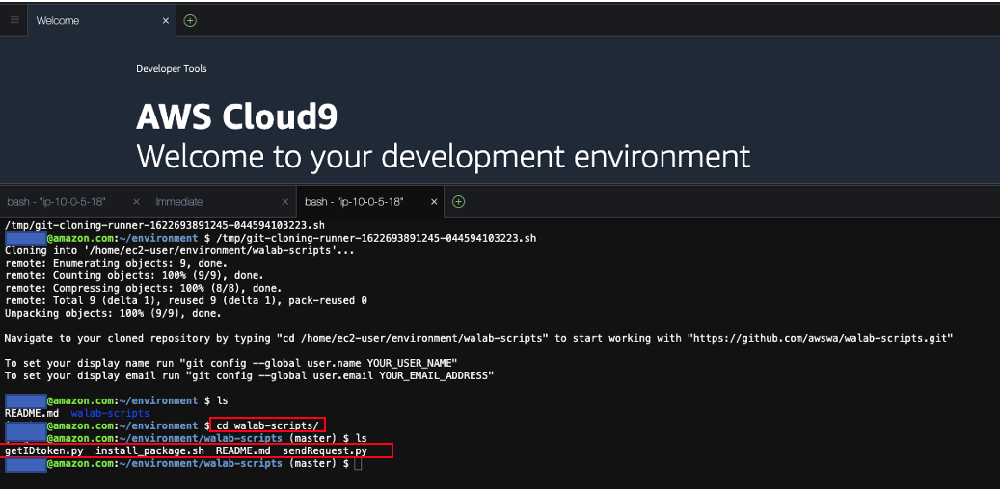
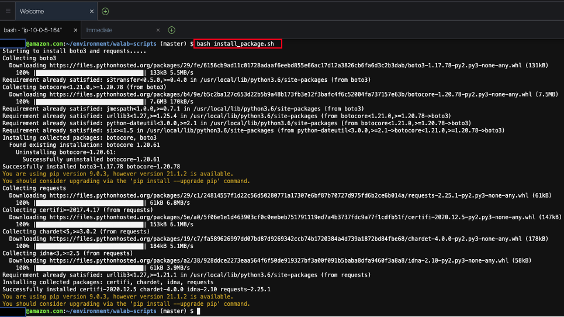

## Deploy the lab base infrastructure

In this section we will build out our base lab infrastructure. This will consist of a public API gateway which connects to Lambda (application layer). The application layer will connect to RDS for MySQL (database layer) within a [Virtual Private Cloud (VPC)](https://docs.aws.amazon.com/vpc/latest/userguide/what-is-amazon-vpc.html). The environment will be deployed to separate private subnets which will allow for segregation of application and network traffic across multiple [Availability Zones](https://docs.aws.amazon.com/AWSEC2/latest/UserGuide/using-regions-availability-zones.html). We will also deploy an [Internet Gateway](https://docs.aws.amazon.com/vpc/latest/userguide/VPC_Internet_Gateway.html) and [NAT gateway](https://docs.aws.amazon.com/vpc/latest/userguide/vpc-nat-gateway.html) along with appropriate routes from both public and private subnets.


When we successfully complete our initial stage template deployment, our deployed workload should reflect the following diagram:




Note the following:

1. The API Gateway has been provided with a role to allow access to invoke the Lambda function in the private subnet (application layer). 

2. The Lambda function has been provided with a role to allow the API Gateway to invoke the Lambda function.

3. Secrets Manager has been configured as the master password store which the Lambda function will retrieve to provide access to RDS. This will allow Secrets Manager to be used to encrypt, store and transparently decrypt the password when required.

4. The Security Group associated with Amazon RDS for MySQL will **only** allow inbound traffic on port 3306 from the specific security group associated with Lambda. This will allow sufficient access for Lambda to connect to Amazon RDS for MySQL. 


> [!NOTE]
> For simplicity, we have used North Virginia **'us-east-1'** as the default region for this lab. Please ensure all lab interaction is completed from this region.

To deploy the template for the base infrastructure complete the following steps:

### 1.1. Get the Cloudformation Template.

To deploy the second CloudFormation template, you can deploy directly via the console.
You can get the template [here.](../../static/300_Multilayered_API_Security_with_Cognito_and_WAF/Code/templates/section1/section1-base.yaml "Section1 template")

#### AWS Console:

If you need detailed instructions on how to deploy CloudFormation stacks from within the console, please follow this [guide.](https://docs.aws.amazon.com/AWSCloudFormation/latest/UserGuide/cfn-console-create-stack.html)

1. Sign in to the AWS Management Console as an IAM user and open the S3 console at [https://console.aws.amazon.com/s3](https://console.aws.amazon.com/s3) as shown:


2. Create a bucket with a unique name and select **us-east-1(N.Virginia)** as the region as shown:



3. Take note of your **S3 Bucket name**, which we will need later in the lab when we create a Cloudformation stack:



4. Download our 3 Lambda deployment packages:

* [rds-create-table.zip](https://d3h9zoi3eqyz7s.cloudfront.net/Security/300_multilayer_api_security_with_congnito_and_waf/rds-create-table.zip "Section1 rds-create-table.zip")
* [rds-query.zip](https://d3h9zoi3eqyz7s.cloudfront.net/Security/300_multilayer_api_security_with_congnito_and_waf/rds-query.zip "Section1 rds-query.zip") 
* [python-requests-lambda-layer.zip](https://d3h9zoi3eqyz7s.cloudfront.net/Security/300_multilayer_api_security_with_congnito_and_waf/python-requests-lambda-layer.zip "Section1 python-requests-lambda-layer.zip")

These packages will be used to build the lambda environment later in the lab.

When you have downloaded all packages, upload all 3 to your new bucket with the sames filesnames:



5. Open the CloudFormation console at [https://console.aws.amazon.com/cloudformation](https://console.aws.amazon.com/cloudformation/) and select **us-east-1(N.Virginia)** as your AWS Region:



6. Select the stack template which you downloaded earlier, and create a stack:


7. For the stack name use **'walab-api'** and enter the bucket name you just created in the parameters. You can leave all other parameters as default value. When you are ready, click the 'Next' button. 


8. Scroll down to the bottom of the stack creation page and acknowledge the IAM resources creation by selecting **all the check boxes**. Then launch the stack. It may take 9~10 minutes to complete this deployment.


9. Go to the **Outputs** section of the cloudformation stack, click **Cloud9URL** to set up your test environment.


10. Run `cd walab-scripts` to ensure Cloud9 automatically cloned all scripts.


11. Run `bash install_package.sh`
* this script will install boto3 and requests



### 1.2. Confirm Successful Application Deployment.

1. Go to the **Outputs** section of the cloudformation stack you just deployed and copy **APIGatewayURL** to make sure if the lab base infrastruture has been successfully deployed.


> [!NOTE]
> Take a note of APIGatewayURL as we will often use this URL for testing.

2. In Cloud9, execute the script called sendRequest.py with the argument of your APIGatewayURL.
```
python sendRequest.py 'APIGatewayURL'
```
Once your command runs successfully, you should be seeing Response code 200 with Response data as shown here:


Click [Use secrets securely](../300_Multilayered_API_Security_with_Cognito_and_WAF/2_use_secrets_securely.md).

___
**END OF SECTION 1**
___
