## Use Secrets Securely

Passwords remain vulnerable to brute force attack methods even if we store our secrets in a secure way. Because of this we can augment our deployed architecture to limit the lifespan of a password through the use of automatic rotation. An ideal way to approach this task is through the use of AWS Secrets Manager, which can enable you to automatically rotate secrets for other databases or 3rd party services.

The second section of the lab will demonstrate how to configure AWS Secrets Manager to securely store your database credentials and automatically rotate them on a schedule for our deployed database. Follow these steps to complete the configuration:

### 2.1. Access Secrets Manager from the Console.

1. Go to the **Outputs** section of the CloudFormation stack you just deployed and click **RDSMysqlSecret** as shown. This will allow you to view AWS Secrets Manager from the console. Alternatively, you can launch the service from the console main menu in the usual way.


2. The secret name will begin with **WARDSInstanceRotationSecret** as shown.

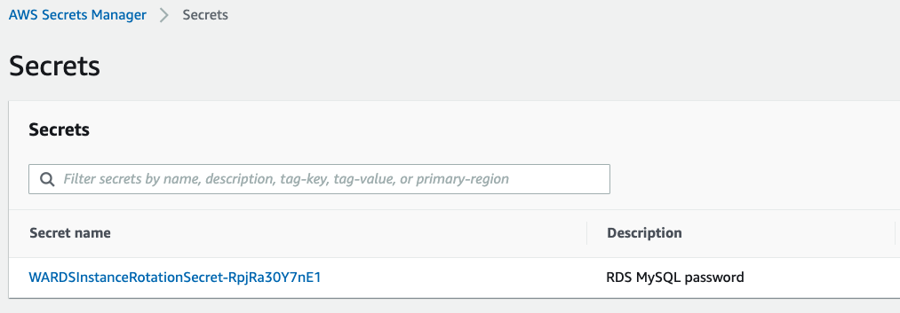

3. By default, AWS Secrets Manager uses [AWS KMS](https://docs.aws.amazon.com/secretsmanager/latest/userguide/services-secrets-manager.html) to encrypt as well as to decrypt your secrets. You can see all current secret values by clicking on the secret name and then selecting **Retrieve secret value** from the dialog box as shown:

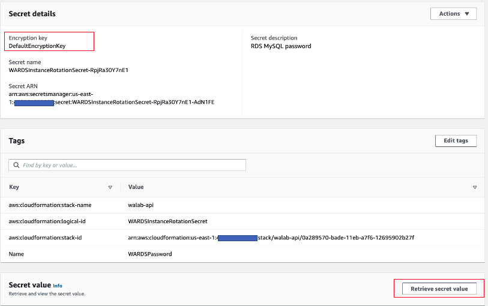

4. As shown below, all sentitive information such as username, password, and RDS endpoint are stored as part of the encrypted secret value. Take this opportunity to record the current password value which we will rotate later in the lab.

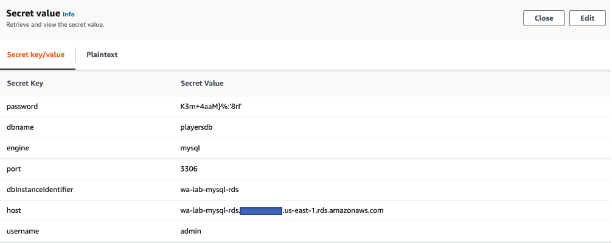

### 2.2. Configure Password Rotation.

AWS Secrets Manager can be configured to automatically rotate a password for an Amazon RDS database. When you enable rotation for Amazon RDS, Secrets Manager provides a complete, ready-to-run Lambda rotation function. More information on this topic can be found [here.](https://docs.aws.amazon.com/secretsmanager/latest/userguide/rotating-secrets-rds.html).

1. To enable rotation, choose **Edit rotation**.


2. Choose **Enable automatic rotation** and select the rotation interval based on your requirement.
    
We will **create a new Lambda function** designed for RDS MySQL. Once you define the new AWS Lambda function name, choose **Use this secret** at the bottom of the dialog box which will select the secret information which will be subjected to rotation as shown.

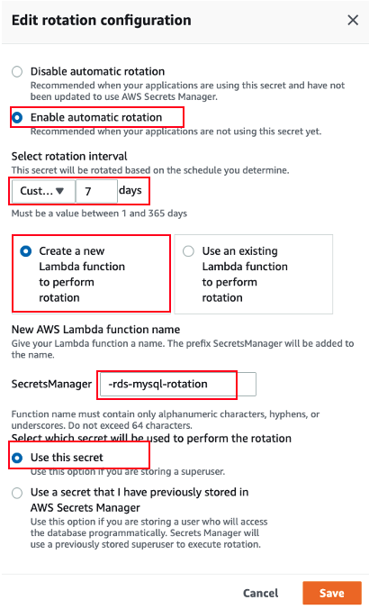

Note that the enabling process may take a few minutes so please be patient.

3. Now that automated rotation has been enabled, click **Rotate secret immediately** to test the rotation as shown. Note that intially **this step will fail**, so remain calm as we will fix this later on!


4. As mentioned previously, rotation will fail. This is because the new Lambda rotation function created by Secrets Manager is not associated with our Lambda Security Group that we explicitly allowed to connect to Amazon RDS for MySQL via port 3306. In order for our newly created rotation to work, your network environment must permit the Lambda rotation function to communicate with your database and the Secrets Manager service. More details on this topic can be found [here](https://aws.amazon.com/premiumsupport/knowledge-center/rotate-secrets-manager-secret-vpc/)

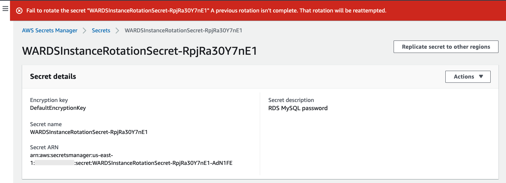

5. A simple workaround to correct our misconfigured rotation is to replace the **Security Group** and **Subnet** in new our Lambda rotation function. To complete this, access **Lambda Function** in AWS console and choose **SecretManager-rds-mysql-rotation**. Note that the function name will be the one you defined at step 2 above as shown.

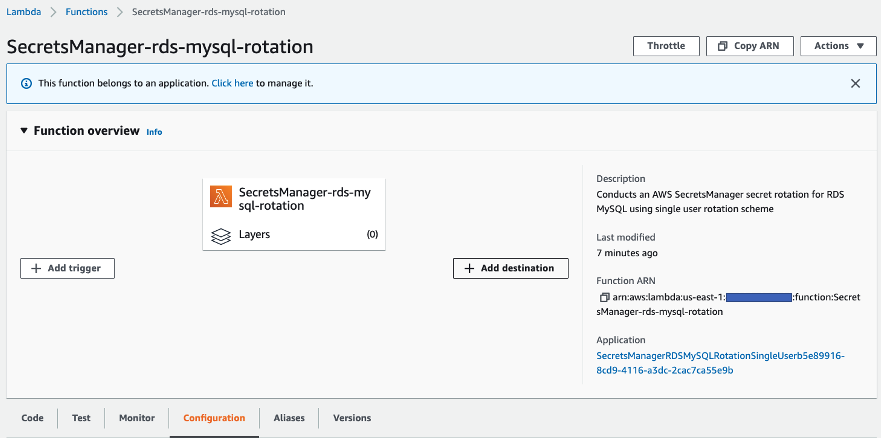

6. Go to the **Configuration** section and **VPC** on the left panel. You can see it's associated with all RDS subnet and security group.

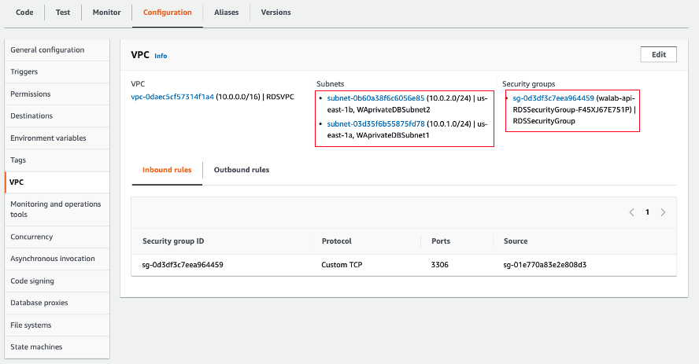

7. Choose **Edit** and remove all Subnet and Security Groups. Then search for **WAprivateLambdaSubnet** for Subnets (select 2 for each availability zone) and **LambdaSecurityGroup** for the Security Group to add them. Confirm that your dialog box looks similar to the screenshot shown below and click **Save**. Note that this process sometimes takes 2~3 minutes to be completed, so please be patient.

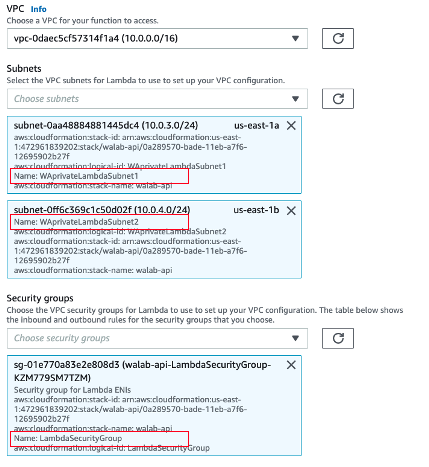

8. Our new Lambda rotation function is now associated with **LambdaSecurityGroup** allowed to connect to RDS for MySQL. Your screen should look similar to the screenshot below:

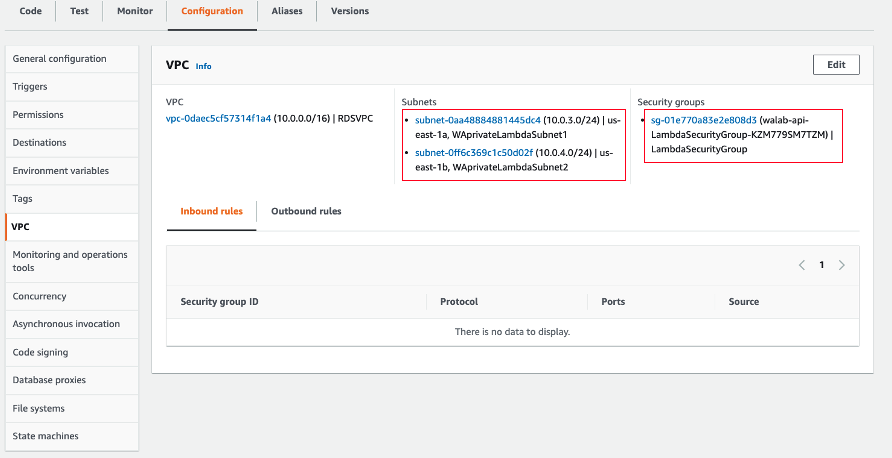

9. Now we should attempt to successfully rotate the password again. To do this, go back to AWS Secrets Manager and select **Rotate secret immediately** to test the rotation. You should now see a message informing you of a successful rotation as shown:

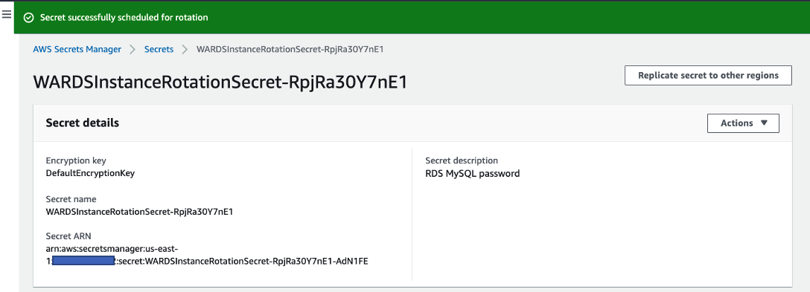

If you are experiencing the same failure as previously, check that you have added the correct **Security Group** and **Subnet** information and retry. This process sometimes takes a few minutes to complete so please be patient.

10. Inspecting the password data within Secrets Manager should now show a change to the original password information which you recorded earlier.

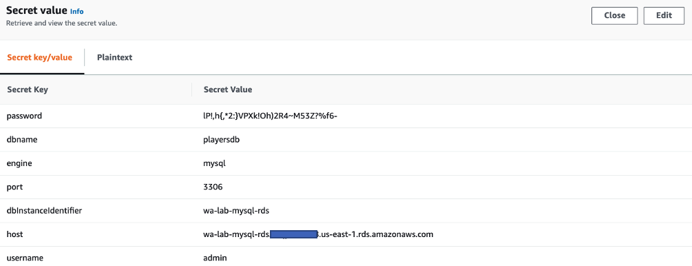

11. Let's confirm if the password in the database has been successfully updated based on the automatic rotation. To do this, go back to **Cloud9** in the console and execute the script called sendRequest.py with the argument of your APIGatewayURL. You will need to change to the walab-scripts directory to execute the script. Make sure you replace **'APIGatewayURL'** with the value you previously used from the Cloudformation stack output.
```
python sendRequest.py 'Enter your APIGatewayURL here'
```
Once your command runs successfully, you should be see a 200 Response code with Response data as shown:


Click [Prevent requests from accessing API directly](./300_Multilayered_API_Security_with_Cognito_and_WAF/)
___
**END OF SECTION 2**
___


