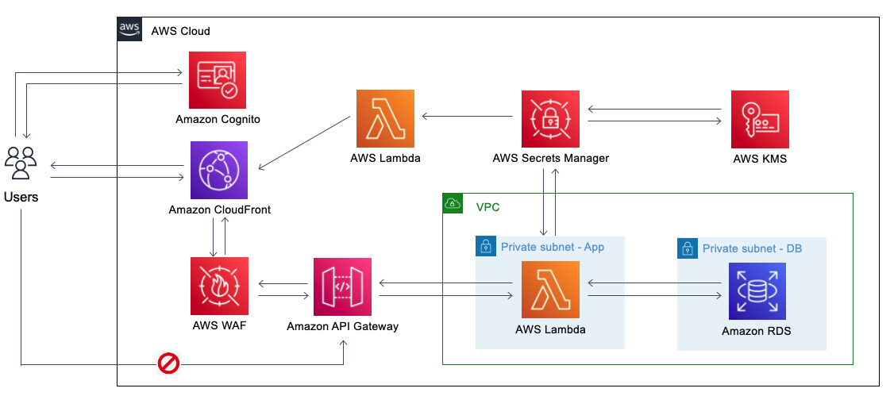
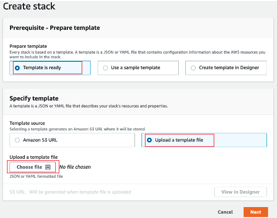
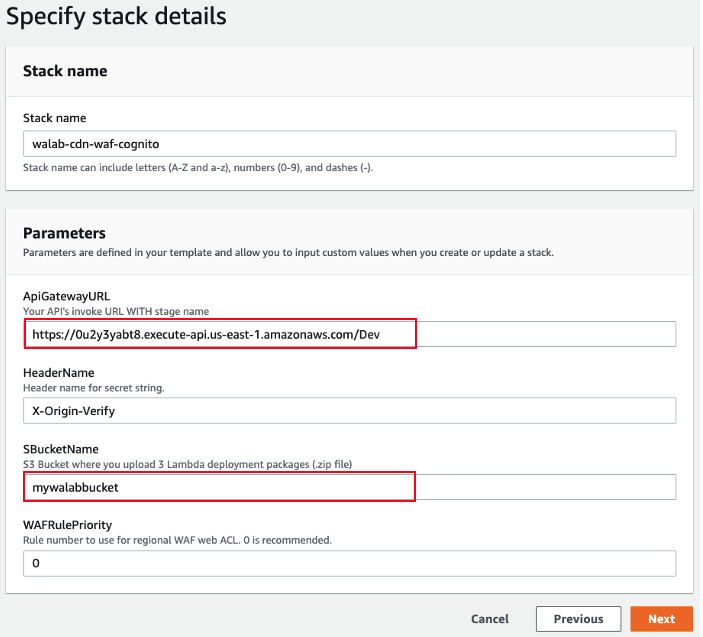
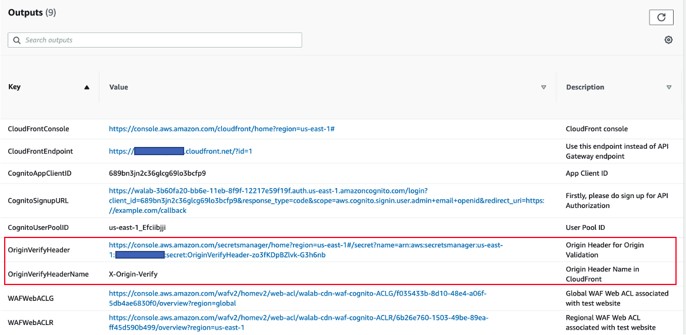
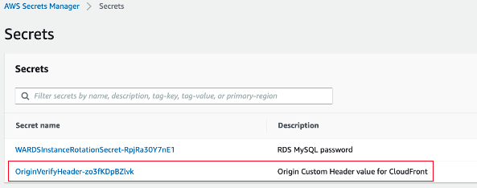
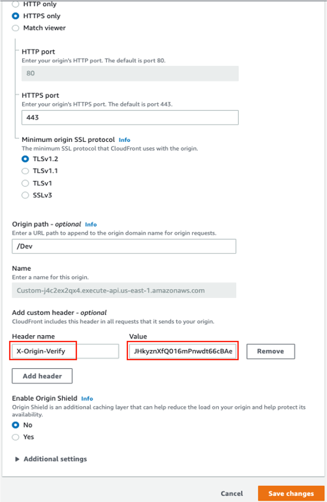
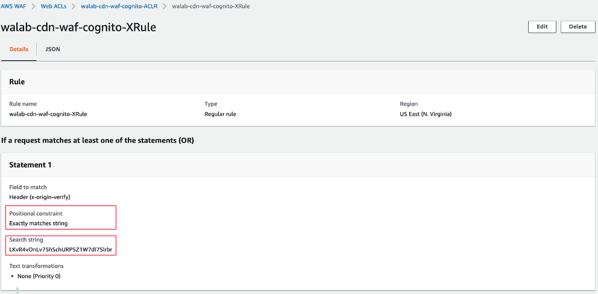
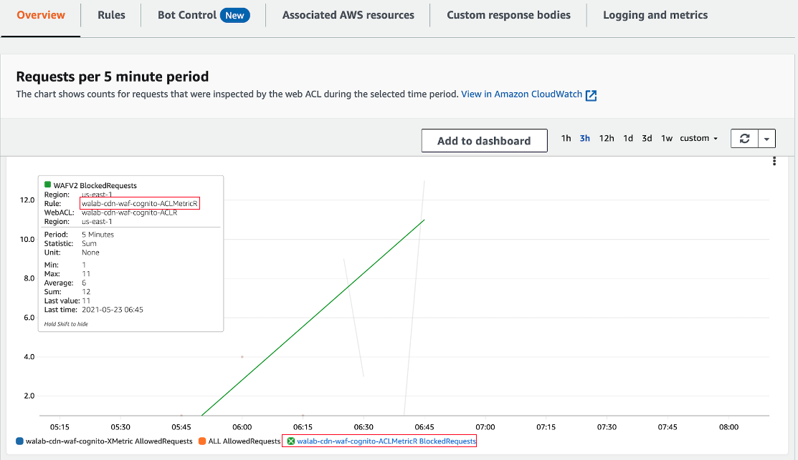

## Prevent requests from accessing API directly

In this section you will be building your own distribution of [Amazon CloudFront](https://aws.amazon.com/cloudfront/) which offers protection at the edge of your architecture. When integrating CloudFront with regional API endpoints, not only does the service distribute traffic across multiple edge locations to improve performance, but also it supports geoblocking, which you can use to help block requests from particular geographic locations from being served. With Amazon CloudFront, you can also enforce encrypted end-to-end connections to an origin API by using HTTPS. Additionally, CloudFront can automatically close connections from slow reading or slow writing attackers. API Gateway can then be configured to **only** accept requests only from CloudFront. This helps prevent anyone from accessing your API Gateway deployment directly. In this section of the lab, you will use a CloudFront custom header value generated by AWS Secrets Manager in combination with [AWS WAF](https://aws.amazon.com/waf/). 

This will build out the architecture as follows:



To complete this section, follow the steps listed below:

### 3.1. Get the Cloudformation Template.

To deploy the second CloudFormation template, you can deploy directly via the console.
You can get the template [here.](../../static/300_Multilayered_API_Security_with_Cognito_and_WAF/Code/templates/section3/section3-enhance_security.yaml "Section3 template")

#### AWS Console:

If you need detailed instructions on how to deploy CloudFormation stacks from within the console, please follow this [guide.](https://docs.aws.amazon.com/AWSCloudFormation/latest/UserGuide/cfn-console-create-stack.html)

1. Sign in to the AWS Management Console as an IAM user or role in your AWS account, and open the CloudFormation console at [https://console.aws.amazon.com/cloudformation](https://console.aws.amazon.com/cloudformation/).

2. Choose a stack template.


3. Go to the **Outputs** section of **your previous cloudformation stack** that you used to deploy the base lab infrastructure. Copy and paste **APIGatewayURL** and provide your **S3 bucket name**. The other values can be left as default. When you are finished with the configuration click 'Next' as shown below.
It may take 3~4 minutes to complete this deployment.


4. Review the template and scroll to the bottom of the screen. Make sure you acknowledge the IAM resource creation and Auto_expand capability by selecting the three tick boxes as shown. When you are ready, click on **create stack**.


### 3.2 Add custom HTTP headers to the requests.

When your stack has finished deployment, you can now add a custom header to the request in CloudFront. As previously described, this will prevent users from bypassing CloudFront to access your API directly. More information on this topic can be found [here.](https://aws.amazon.com/blogs/security/how-to-enhance-amazon-cloudfront-origin-security-with-aws-waf-and-aws-secrets-manager/)

To complete this configuration, complete the following steps:

1. When the current CloudFormation stack has finished deployment, go to the **Outputs** section of the stack. Verify that your **OriginVerifyHeaderName** is set to **X-Origin-Verify**. Now click the value for **OriginVerifyHeader** to take you back to AWS Secrets Manager as shown:



2. From AWS Secrets Manager, click the **OriginVerifyHeader** secret to get the **X-Origin-Verify** header value:



3. From the Secret Value dialog box, click **Retrieve secret value**. Record the **Secret Value** of HEADERVALUE. We will use this value as the **Origin Header** value in CloudFront. Secrets Manager will now be responsible for automatically rotating this header value to prevent possible future compromise in the same way that we rotated the password information earlier in the lab.


4. Now we can configure CloudFront. You do this by either lauching CloudFront from the console in the standard way, or by clicking the URL of **CloudFrontConsole** in the **Outputs** section of the current CloudFormation stack. You should be able to see our newly created CloudFront distribution. Click on the **ID** field as shown:


5. Go to the **Origins and Origin Groups** tab and select your CloudFront Origin to edit its configuration as shown:


6. In the **Origin Custom Headers** section, enter **'X-Origin-Verify'** as the **Header Name** and use the previously recorded value from the AWS Secrets Manager **HEADERVALUE** as the **Value** as shown:



CloudFront will now add the **Origin Custom Header** into all incoming request from the client applications or user traffic.

7. Note that your configuration won't take effect until the distribution has propagated to the AWS edge locations. It may take 3~5 minutes so please be patient. You can check the status of the propagation as shown:


8. When your CloudFront propagation completes, we will move to configuring WAF. The second CloudFormation template which we deployed, automatically creates Web ACLs and added associated rules to inspect the incoming request header **X-Origin-Verify**. A Web ACL (Web Access Control List) is the core resource in an AWS WAF deployment. It contains rules that are evaluated for each request that it receives.

To review the WAF rules, go to the current CloudFormation stack **Outputs** tab and click **WAFWebACLR** to go to **Web ACLs** as shown:


9. Go to **Rules**, there will be only one rule created as **{Your Stack Name}-XRule**.


10. By default, any requests that do not match the listed rules in the Web ACLs will be **blocked**. In this case, the rule will **allow** the request **ONLY** if the string value of **X-Origin-Verify** is valid. If the header isn’t valid, AWS WAF blocks the request:



11. Let's test our configuration to check functionality. To do this go to the stack **Outputs** tab of the current CloudFormation template. From there, click **CloudFrontEndpoint** to verify if now API clients access your API only through a CloudFront distribution. It will automatically have query string.


Clicking on the link should show a successful query of your favourite player.

> [!NOTE]
> Take a note of CloudFrontEndpoint as we will often use this URL for testing.

## 3.3 Verify if API only accepts the request from CloudFront.

1. From the console access the  **Cloud9** service and go to your IDE. We will now test with both the **CloudFrontEndpoint** and the **APIGatewayURL** to see the difference in behaviour.

* Firstly, change to the **walab-script** directory and execute the script called sendRequest.py with the argument of your **CloudFrontEndpoint** as shown:

```
python sendRequest.py 'CloudFrontEndpoint'
```
* Note the output from the previous command and now execute the same script with the argument of your **APIGatewayURL** as shown:

```
python sendRequest.py 'APIGatewayURL'
```

You should notice a different output based on the argument that you pass to the script. When you run the script with the **CloudFrontEndPoint** argument, you should receive a 200 response code, which indicates a successful query. However, when you run the same script against the **APIGatewayURL** directly, you will notice that a 403 response code is generated. This indicates that the request is detected as forbidden as this request does not have the **X-Origin-Verify** field together with the required value. Run both script outputs a few times to generate some data.

Check that your output is similar to the screenshot below:


2. Now go back to the WAF Console and select the **Overview** tab to see the metrics of the ACL. You can confirm your request was blocked by WAF from this metrics. Click **{Your Stack Name}-ACLMetricR BlockedRequests** BlockedRequests to see only blocked request by SQL database. 



> [!NOTE]
> Your graph shape will be different depending on the number of times you executed the script with the CloudFront Endpoint and the APIgateway address.

Click [Application layer defense](./4_application_layer_defence.md).
___
**END OF SECTION 3**
___
