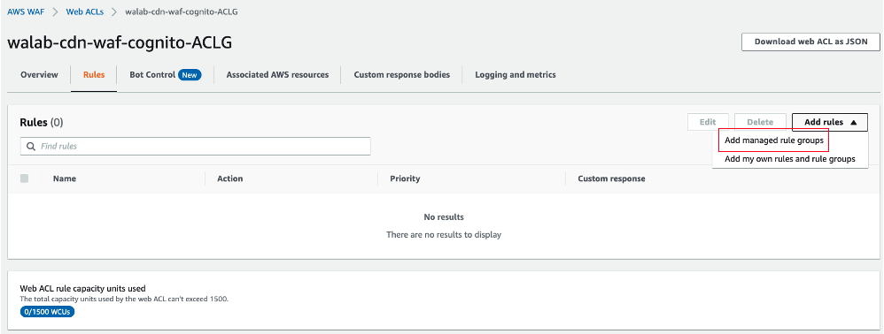
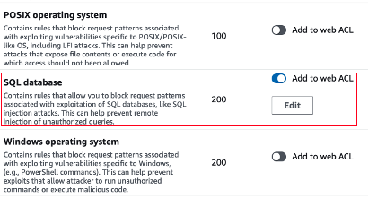
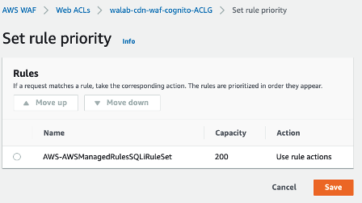
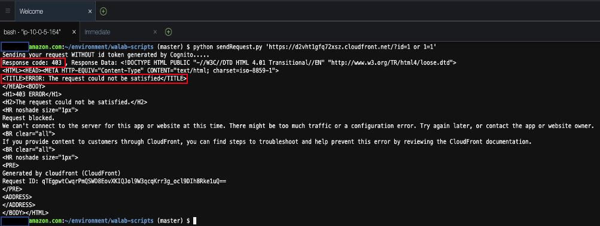
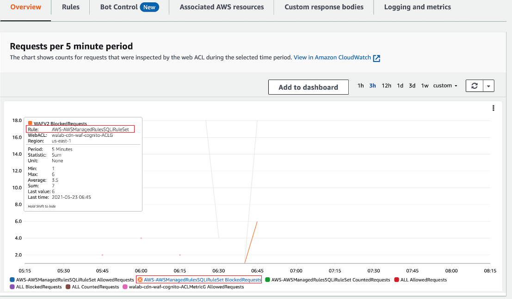

## Application layer defence

In this section we will tighten security using AWS WAF further to mitigate the risk of vulnerabilities such as SQL Injection, Distributed denial of service (DDoS) and other common attacks. WAF allows you to create your own custom rules to decide whether to block or allow HTTP requests before they reach your application.

### 4.1. Identify the risk of vulnerabilities.

A SQL Injection attack consists of insertion of a SQL query via the input data to the application. A successful SQL injection exploit can be capable or reading sensitive data from a database, or in extreme cases data modification/deletion. 

Our current API retrieves data from RDS for MySQL and relies on the user interacting via CloudFront. However, it is still possible for malicious SQL code to be injected into a web request, which could result in unwanted data extraction.

As a simple example, simply add **'or 1=1'** at the end of your CloudFront domain name as shown:

```
https://Your_CloudFront_Domain_Name/?id=1 or 1=1
```


As you can see from the output, using this simple SQL injection could result in an attacker gaining access to all the data in our database:


This section of the lab will focus on some techniques which work to block web requests that contain malicious SQL code or SQL injection using AWS WAF.

### 4.2. Working with SQL injection match conditions.

1. From CloudFormation, locate the second stack which you deployed. On the stack **Outputs** tab, click **WAFWebACLG** to go to **Web ACLs** to review Rules in WAF. This web ACL is associated with CloudFront.


2. Go to the **Rules** tab and select **add managed rule groups** as shown:



3. Expand the **AWS managed rule groups** section and enable the **SQL database** rules as shown: 


By doing this we are adding rules that allow you to block request patterns associated with exploitation specific to SQL databases, such as SQL injection attacks. Make sure you select **Add rules** at the bottom of the screen to proceed to the next stage.

4. It is possible to assign priorities based on the rules which you specify. As you only have one rule at this moment, we can skip this configuration. Click **Save**:



5. You should now be able to see the **AWS-AWSManagedRulesSQLiRuleSet** added to web ACL as shown:


6. We can now rerun our test again, which should hopefully produce a different output. 

Use your **CloudFrontEndpoint** to run the same query as before, inclusive of the injection attack at the end. This can be done in either a web-browser or your Cloud9 IDE environment using the script that we have provided previously:



If your configuration is correct, you should now see a **Response code: 403**. This means that WAF has **blocked** this request as malicious code has been detected in the input.


7. We can now check that the blocked request has registered in our ACL metrics. To do this, go to the **Overview** in WAF console to see the metrics of ACL. You can confirm your request was blocked by WAF from this metrics. Click **AWS-AWSManagedRulesSQLiRuleSet BlockedRequests** to see only blocked request by SQL database. Note that your output may differ from the screenshot below depending on the amount of blocked requests that you sent.



Click [Contol access to API](./5_control_access_to_API.md)
___
**END OF SECTION 4**
___

