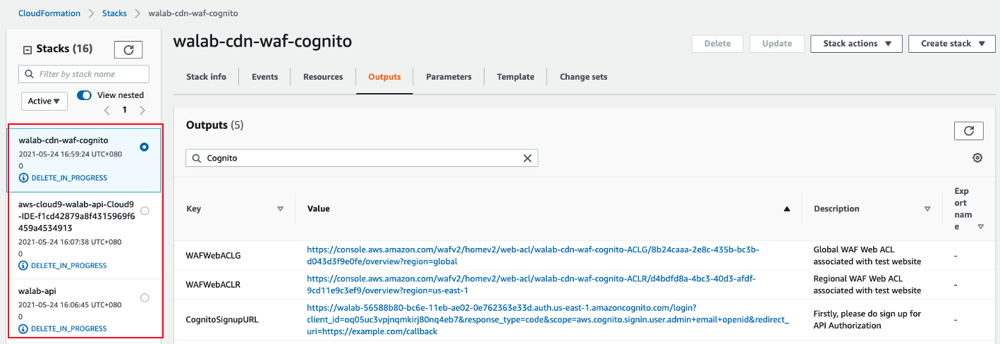

## Tear down

The following steps will remove the services which are deployed in the lab.

### 1. Delete CloudFormation stacks
Simply delete 3 CloudFormation stack created in this lab.
* One CloudFormation Stack for Cloud9
* Two CloudFormation Stacks to build out the lab base infrastructure and enhanced security services.

### 2. Remove the CloudWatch Log Group

From the CloudWatch console, select **Log group** under **Logs** and select the log group which you created in the lab.

Select the **Actions** button and delete the log group confirming the deletion.
***

___

**You have successfully deleted all resources you deployed.**
___